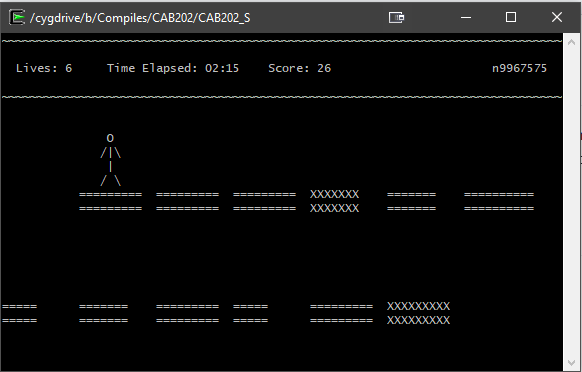
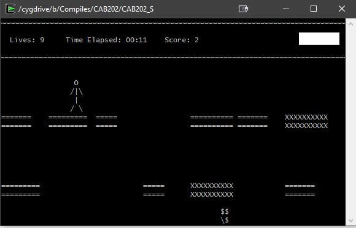

# block_hopper
Block Hopper is a terminal based game written in C where the player must jump between blocks to accumulate points. The higher the score, the better. Players can also jump and capture the treasure which floats along the bottom of the screen to accumulate a one off bonus of lives.

## Features
- Randomly generated maps (block randomisation)
- Vertical and Horizontal acceleration
- Realistic velocity model
- Animated Graphics
- Scoring System

## Functionality
As the game runs the user must navigate the platforms to find the best way to accumulate as many points as possible with a randomly generated map. Avoid the no-go blocks marked as *X's* and also try to avoid falling off the map!

## Screen Captures

## Authors
[@benjaminbrewerton](https://github.com/benjaminbrewerton)

## Disclaimer
Unfortunately since this was developed for a university assignment, I cannot release the source code. However, if anyone is privately interested, please feel free to contact me at benbrewerton98@gmail.com
